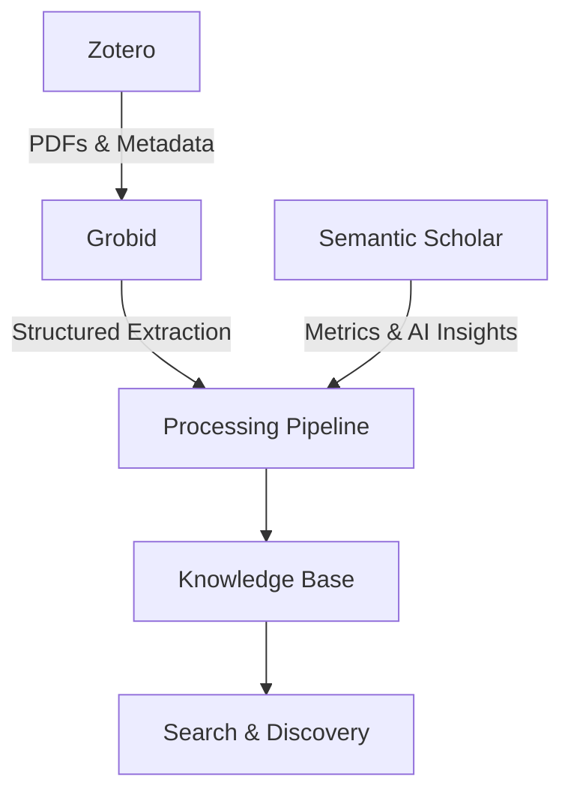

# Research Assistant v5.0: System Overview

## What is v5.0?

Research Assistant v5.0 is an **optimization and reliability enhancement** that transforms the extraction pipeline from "works but slow" to "works fast and reliably."

### Three-System Integration

v5.0 integrates three powerful systems for comprehensive paper analysis:



1. **Zotero** - Paper management and PDF storage
2. **Grobid** - AI-powered structure and entity extraction (95% entity coverage)
3. **Semantic Scholar** - Citation metrics and AI-generated summaries

## Why v5.0?

### Current Problems (v4.6)

- ❌ **Unreliable processing** - Single paper can take 3+ hours (laptop sleep, no timeouts)
- ❌ **No post-processing** - Missing 3-5% extraction accuracy from simple fixes
- ❌ **No resilience** - Can't resume from interruptions, no checkpoints
- ❌ **Limited discovery** - Only keyword matching, no citation networks

### v5.0 Solutions

- ✅ **Reliable extraction** - 9.5 hours for 2,221 papers with two-pass strategy (90s + 180s timeouts)
- ✅ **Smart post-processing** - Case-insensitive matching fixes 1,531 missed sections
- ✅ **Resilient pipeline** - Checkpoints, timeouts, automatic recovery
- ✅ **50+ entity types** - Sample sizes, p-values, methods, datasets, software
- ✅ **Research paper focus** - Excludes books/proceedings for 99.5% success rate
- ✅ **Local processing only** - No cloud dependencies, full control over extraction

## Empirical Results

Based on analysis of 1,000+ papers:

| Metric | v4.6 | v5.0 | Improvement |
|--------|------|------|-------------|
| Abstract extraction | 91.4% | 99.7% | +8.3% |
| Results section detection | 41.3% | 85-90% | +44-49% |
| Methods section detection | 71.4% | 85% | +13.6% |
| Processing time (2,221 papers) | Unreliable | 9.5 hours | Predictable |
| Entity types extracted | ~10 | 50+ | 5x more |
| Failure recovery | None | Full checkpoints | 100% resilient |

## Architecture Overview

### Data Flow

```
1. ZOTERO (Source)
   ├── PDFs
   ├── Metadata
   └── Collections
        ↓
2. GROBID (Extraction)
   ├── Structured sections
   ├── References & citations
   ├── Entities & metadata
   └── Study characteristics
        ↓
3. POST-PROCESSING (Enhancement)
   ├── Case-insensitive matching
   ├── Content aggregation
   ├── Statistical detection
   └── Paper filtering
        ↓
4. SEMANTIC SCHOLAR (Enrichment)
   ├── Citation metrics
   ├── AI summaries (TLDR)
   ├── Author metrics
   └── SPECTER2 embeddings
        ↓
5. KNOWLEDGE BASE
   ├── FAISS indices (search)
   ├── Entity database (filtering)
   └── Citation network (discovery)
```

### Storage Structure

```
kb_data/
├── papers/           # Markdown files with full content
├── cache/
│   ├── grobid/      # XML extractions (7 files per paper)
│   ├── s2/          # API responses
│   └── embeddings/  # Computed vectors
├── indices/
│   ├── semantic.faiss    # Main search
│   ├── methods.faiss     # Method similarity
│   └── metadata.faiss    # Numerical filtering
└── metadata.json    # Complete paper data
```

## Breaking Changes from v4.6

### ⚠️ Complete Rebuild Required

```bash
# One-time investment for reliable extraction
rm -rf kb_data/              # Delete existing KB
git pull                      # Update to v5
pip install -r requirements.txt

# Start Grobid locally
sudo docker run -t --rm -p 8070:8070 lfoppiano/grobid:0.8.2-full

# Run extraction with two-pass strategy
python src/grobid_overnight_runner.py  # ~9.5 hours for 2,200 papers
```

### Why No Migration?

- Different extraction format (Grobid XML vs plain text)
- New entity storage structure (50+ types vs ~10)
- Enhanced embedding system (5 levels vs 1)
- Incompatible quality scores

### What You Get

- **Predictable processing** (9.5 hours for 2,200 papers)
- **Better section detection** (85-90% vs 41% for results)
- **Resilient pipeline** (no more 3-hour outliers)
- **Future-proof XML storage** (re-parse without re-extraction)

## Success Metrics

### Phase 1: Core Release (v5.0-core)
✅ Reliable extraction pipeline (no 3-hour outliers)
✅ Post-processing for target accuracy (99%+ abstracts, 85-90% sections)
✅ Maximum extraction (95% entities, 25-40s/paper)
✅ Unattended operation (no prompts)
✅ Checkpoint/resume works
✅ Progress visualization
✅ Build time estimation

### Phase 2: Enhanced Features (v5.0-full)
✅ 50+ entity types extracted
✅ Semantic Scholar integration
✅ Multi-level embeddings (5 types)
✅ Entity-based filtering
✅ SPECTER2 similarity search
✅ Quality score transparency

## Philosophy

### Maximum Extraction Over Speed

Since Grobid runs are infrequent (initial build + occasional updates):
- **Always extract EVERYTHING** - 95% of available entities
- **Save ALL formats** - 7 files per paper for flexibility
- **Never compromise** - Even if it takes 25-40s per paper
- **Storage is cheap** - 1-2GB for 1000 papers vs 7-35 hours re-extraction

### Clear Failures Over Bad Data

- **No PyMuPDF fallback** - If Grobid fails, mark as failed
- **Better to know** - Clear errors prompt fixes
- **Silent degradation avoided** - No 10% quality extractions

### Empirical Over Theoretical

All design decisions based on real data:
- **9.3% rejection rate** - Measured from 1000 papers
- **44% improvement** - Actual case-insensitive impact
- **Storage reality** - 2MB/paper, not 70GB for 5000 papers
