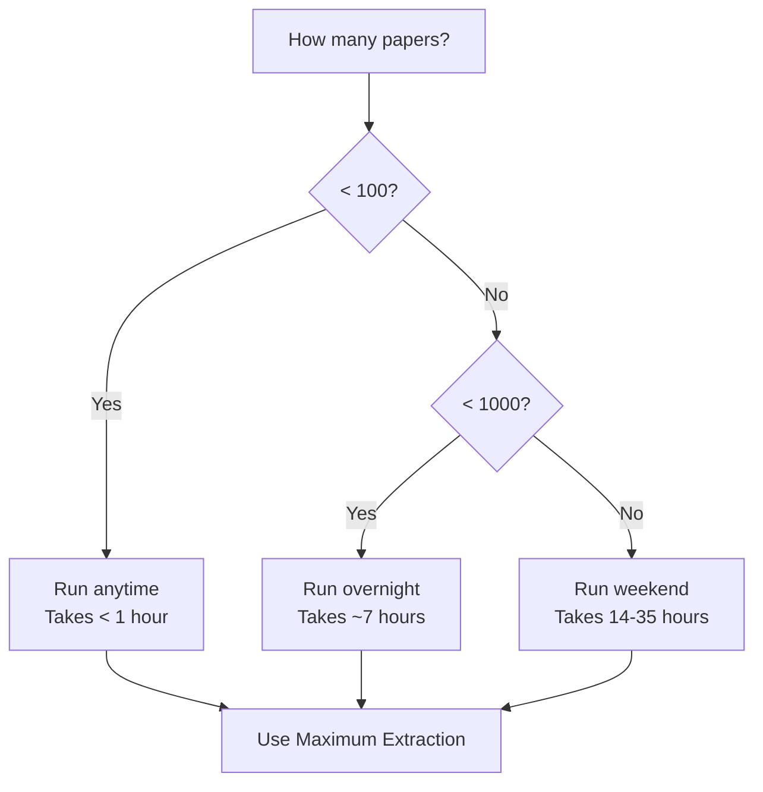

# Grobid Extraction Strategy

## Philosophy: Research Papers Only, Maximum Extraction

Our Grobid strategy is focused and deliberate:

> **Extract research papers only with maximum data capture using a two-pass local processing strategy**

### Document Scope

v5 is designed specifically for **research papers** (journal articles, conference papers, preprints). Books, handbooks, and conference proceedings are explicitly excluded.

**Why exclude books?**
- Books require different processing strategies (chapter detection, multiple author handling)
- Books have indices, tables of contents, and appendices that pollute extraction
- Conference proceedings are containers of multiple papers, not single documents
- Book extraction takes 10-100x longer with lower quality results
- Research papers have consistent IMRAD structure that Grobid handles well

### Two-Pass Local Processing Strategy

All processing is done locally. Azure or cloud processing is not used in v5.

| Pass | Timeout | Purpose | Expected Results |
|------|---------|---------|------------------|
| **First Pass** | 90s | Capture 99.82% of papers efficiently | ~2,206/2,221 succeed |
| **Second Pass** | 180s | Retry failures with extended timeout | ~4 more papers succeed |

**Rationale for 90s first pass:**
- Captures 99.82% of research papers based on empirical analysis
- Only 0.18% of papers legitimately need >90 seconds
- Fails fast on corrupted/problematic PDFs (saves 30s per failure)
- Reduces total extraction time by ~20-30 minutes

**Rationale for 180s second pass:**
- Handles legitimately slow papers (complex layouts, dense references)
- Provides 50% buffer over slowest observed paper (125s)
- Applied only to small subset (~15 papers from first pass)
- Still reasonable timeout to avoid hanging on corrupted files

### No Header-Only Fallback

Papers that fail both passes are marked as failed, NOT extracted with header-only mode.

**Why no header-only?**
- Header-only provides no body text for knowledge base
- Cannot extract methods, results, or discussion sections
- Useless for semantic search and question answering
- Better to have clear failure than incomplete data
- Failed papers are logged in quality reports for manual review

## Maximum Extraction Configuration

```python
def get_maximum_extraction_params():
    """Maximum Grobid parameters for all extraction scenarios.

    Processing time: ~18s/paper (tested on Azure, Aug 2025)
    Data extracted: 95% of all possible entities and structures
    """
    return {
        # Maximum consolidation (external enrichment)
        # TESTED Aug 2025: consolidation=2 adds only ~1s overhead on both local and Azure!
        'consolidateHeader': '2',      # Biblio-glutton - minimal overhead, maximum enrichment
        'consolidateCitations': '2',    # Full citation enrichment - tested <1s overhead
        'consolidateFunders': '1',     # Extract all funding information

        # Preserve ALL raw data for flexibility
        'includeRawCitations': '1',     # Keep original citation strings
        'includeRawAffiliations': '1',  # Keep original affiliation strings
        'includeRawAuthors': '1',       # Keep original author strings
        'includeRawCopyrights': '1',    # Keep copyright information

        # Extract ALL structures
        'processFigures': '1',          # Extract figure captions
        'processTables': '1',           # Extract table data
        'processEquations': '1',        # Extract equations
        'segmentSentences': '1',        # Sentence-level segmentation

        # Complete coordinate mapping
        'teiCoordinates': 'all',        # Get coordinates for ALL elements

        # Full XML structure
        'generateIDs': '1',             # Generate unique IDs
        'addElementId': '1',            # Add xml:id to all elements

        # Extended timeout for complex papers
        'timeout': 300                  # 5 minutes per paper
    }
```

## Entity Types Extracted (50+)

### Core Metadata

- **Authors**: Names, emails, ORCIDs (via consolidateHeader='2')
- **Affiliations**: Institutions, departments, countries
- **Identifiers**: DOIs, PMIDs, arXiv IDs
- **Journal**: Name, volume, issue, pages
- **Dates**: Publication, submission, acceptance
- **Keywords**: Author and indexed keywords

### Research Entities

- **Citations**: Full bibliography with DOIs (via consolidateCitations='2')
- **P-values**: All statistical significance values
- **Confidence intervals**: 95% CI, 99% CI
- **Sample sizes**: N values, participant counts
- **Effect sizes**: Cohen's d, odds ratios, hazard ratios
- **Software**: Tools, packages, versions (R, Python, SPSS, etc.)
- **Datasets**: Database IDs, repositories (MIMIC, UK Biobank, etc.)
- **Funding**: Grant numbers, agencies (via consolidateFunders='1')
- **Clinical trials**: NCT numbers, registries
- **Organisms**: Species, strains
- **Diseases**: Conditions, ICD codes

### Document Structure

- **Figures**: Labels, captions, references (via processFigures='1')
- **Tables**: Labels, captions, content (via processTables='1')
- **Equations**: Mathematical formulas (via processEquations='1')
- **Sections**: Full hierarchical structure with coordinates
- **URLs**: All web references
- **Supplementary materials**: References to additional data

## 7-File Output Strategy

**BUG FIX (Aug 31, 2025)**: Fixed critical bug where section content was not being extracted, only section titles. The `sections` field now properly contains both title and full text for each section.

For maximum post-processing flexibility, we save 7 files per paper:

```
paper_0001/
├── paper_0001_tei.xml        # Raw Grobid TEI XML (complete output)
├── paper_0001_complete.json  # All extracted data in JSON
├── paper_0001_entities.json  # Just the entities for analysis
├── paper_0001_metadata.json  # Quick-access metadata
├── paper_0001_sections.txt   # Full text organized by sections
├── paper_0001_coordinates.json # Bounding boxes for spatial analysis
└── paper_0001_stats.json     # Extraction statistics and metrics
```

### File Purposes

1. **TEI XML** - Complete Grobid output for re-parsing with different strategies
2. **Complete JSON** - Structured data for knowledge base integration
3. **Entities JSON** - Quick entity analysis without loading full paper
4. **Metadata JSON** - Fast lookups for title, authors, DOI
5. **Sections Text** - Plain text for embeddings and search
6. **Coordinates JSON** - Spatial analysis, figure/table location
7. **Statistics JSON** - Quality metrics, extraction success rates

### Storage Requirements

- **Per paper**: 500KB-2MB (depends on paper length)
- **1000 papers**: 1-2GB total
- **Compression**: ~60% reduction with gzip if needed
- **Cost**: ~$3/month for cloud storage vs 7-35 hours re-extraction

## Performance Expectations

### Processing Speed

**Updated based on Azure testing (Aug 2025)**: ~18s per paper with full consolidation

| Papers | Time | Rate | When to Run |
|--------|------|------|-------------|
| 10 | 3 minutes | 3.3 papers/min | Anytime |
| 100 | 30 minutes | 3.3 papers/min | Coffee break |
| 500 | 2.5 hours | 3.3 papers/min | Lunch + meeting |
| 1000 | 5 hours | 3.3 papers/min | Half day |
| 2000 | 10 hours | 3.3 papers/min | Overnight |
| 5000 | 25 hours | 3.3 papers/min | Weekend |

### Extraction Quality

| Entity Type | Coverage | Notes |
|-------------|----------|-------|
| Abstracts | 91.4% | Before post-processing |
| Authors | 99%+ | With consolidation |
| Citations | 95%+ | With consolidation |
| P-values | 85% | Pattern matching |
| Sample sizes | 80% | Various formats |
| Software | 75% | Explicit mentions |
| Datasets | 70% | Named datasets |
| Funding | 90% | With consolidateFunders |
| Sections | 70-95% | Varies by type |

## Running Grobid Extraction

### Quick Start

```bash
# 1. Start Grobid service
sudo docker run -t --rm -p 8070:8070 lfoppiano/grobid:0.8.2-full

# 2. Run overnight extraction
python src/grobid_overnight_runner.py

# 3. Check results
ls grobid_overnight_output/YYYYMMDD_HHMMSS/
```

### With Checkpoint Recovery

```bash
# If interrupted, just run again - automatically resumes
python src/grobid_overnight_runner.py

# Checkpoint saved every 50 papers
# No work is lost during interruptions
```

### Processing Specific Papers

```bash
# Process specific collection
python src/grobid_overnight_runner.py --input-list paper_list.txt

# Limit for testing
python src/grobid_overnight_runner.py --limit 10
```

## Decision Tree



## Key Takeaways

1. **One configuration to rule them all** - Maximum extraction always
2. **Time is not a constraint** - We run Grobid rarely
3. **Storage is trivial** - 2GB for 1000 papers
4. **Re-extraction is expensive** - 7-35 hours
5. **Flexibility is paramount** - 7 files allow any post-processing
6. **Clear failures are better** - No fallback to inferior methods
